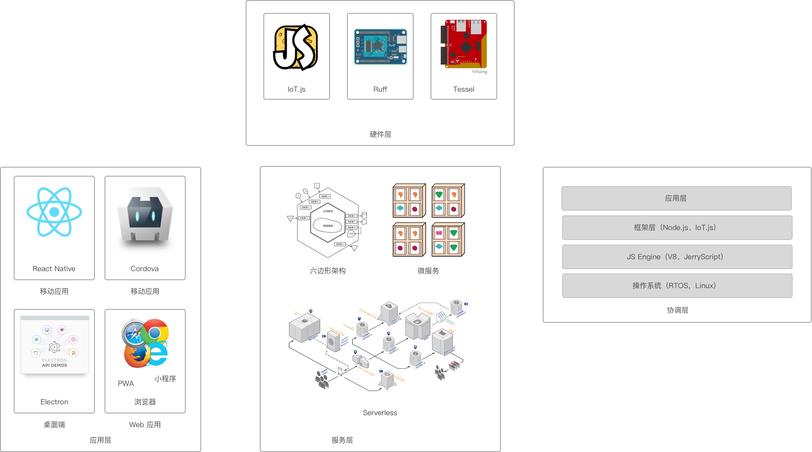
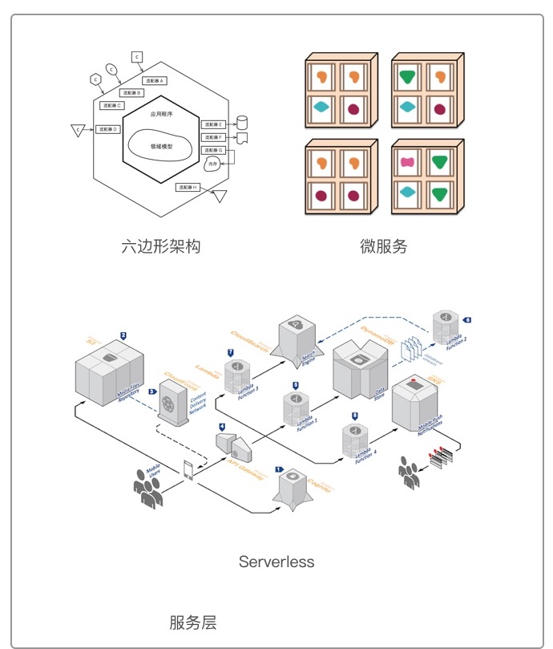
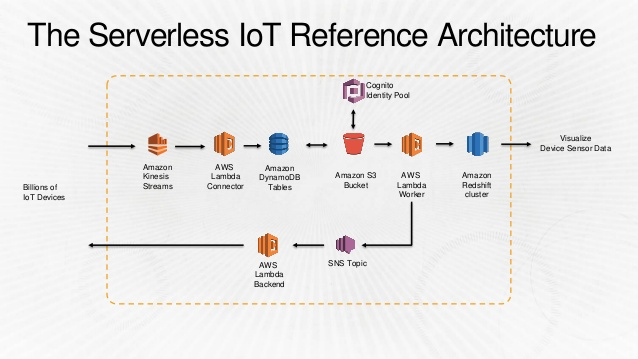
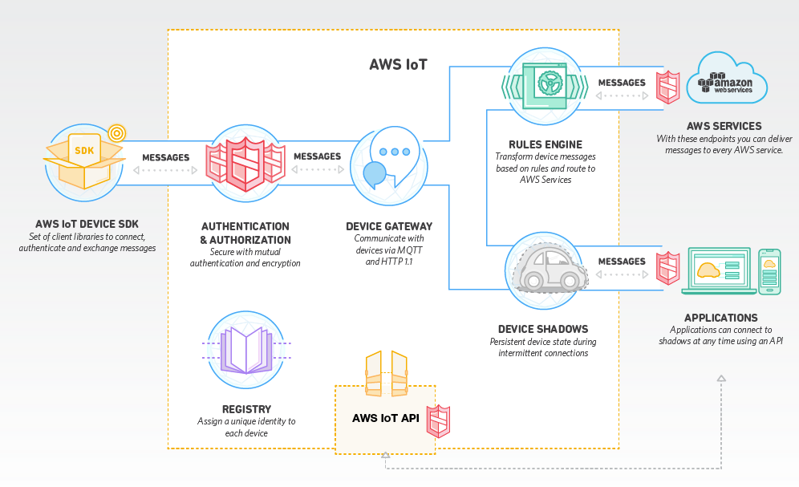
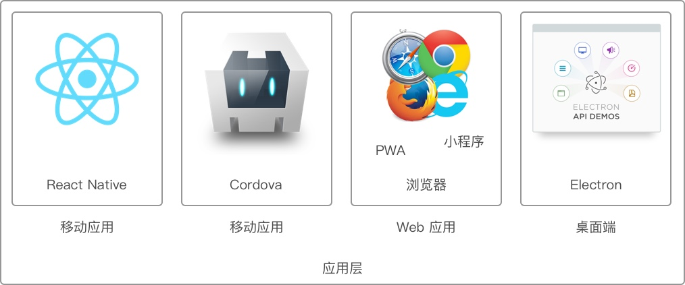
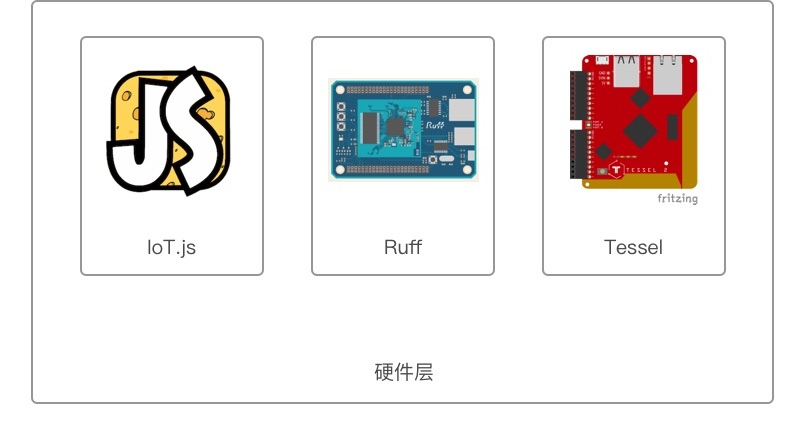
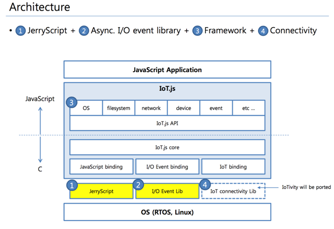
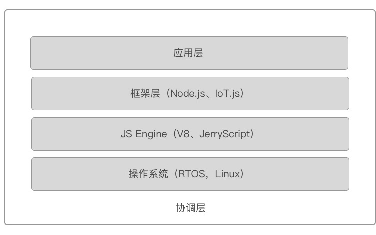

基于 JavaScript 语言的快速物联网开发架构
===

> 凡是能用JavaScript写出来的，最终都会用JavaScript写出来。            ---Atwood定律

物联网来源于 Internet of Things 一词，即世间万物的互联网。顾名思义，物联网的意思就是物物相连的互联网。而物联网架构与现有的互联网架构相比，也充满了诸多的相似之处。

而随着 JavaScript 语言的流行，及物联网领域的崛起，我们能看到它们结合的可能性。并且发现，它也特别适合于物联网开发。因此，在这篇文章里，我将介绍：

 - 典型的物联网架构，及多种语言带来的问题
 - 只使用 JavaScript 语言的物联网架构
 - 详解基于 JavaScript 语言的物联网不同层级结构

那么，先让我们看看典型的物联网架构是怎样的吧！

典型的物联网架构
---

我们甚至还可以认为，**物联网只是对互联网的扩展**。与传统的 CS 架构相比，它多了一个“数据采集层”，我们称之为传感器层、硬件层等等。数据的产出不再只是用户，还来自于各式各样的联网设备。物联网不再局限于使用 HTTP 协议来传输数据，它还会使用 CoAP（受限制的应用协议）、MQTT（消息队列遥测传输）协议。

### 物联网的四个层级

当前的物联网应用，所要做的就是**控制**和**数据处理**。指令，由用户到终端一层一层往下下达，直到硬件端由设备去执行。而数据，便是一层一层往上上报，直至被可视化。

因此，与互联网的架构相比，起点与终点不一样了：指令的终点与数据的起点，变成了硬件层，而非最后的用户层。

数据由客户端 A 发送到服务端，客户端 B 再从服务端获取 A 的数据，如此便算是完成一个回路。而物联网架构则稍微麻烦了一些，多了一个层级，便多了一个步骤。

硬件层上的微控制器采集通过直连的方式，采集各式各样的数据，温度、湿度等等。而受限于微控制器的成本、环境条件等原因，它可能无法直接连接到互联网。因此，它需要连接到一些额外的联网设备才能实现。

而这一些联网设备，会负责处理来自各个硬件设备的数据，便将这些数据上传到服务器。同时，它会提供一个无线（如蓝牙、红外、ZigBee）接口作为数据的入口。因此，这一个层级需要有更好的数据处理能力，并且它应该要可以**快速开发**。因为这一些设备，主要作的是协调工作，我习惯于将之称为『协调层』。

### 使用多种语言的物联网

多年以前，我做过一个并不复杂的物联网系统：

 - 使用 Python 语言里的 Django 作为 Web 服务框架，Django REST Framework 创建 RESTful API。
 - 为了使用手机作为控制器，还用 Java 写一个 Android 应用
 - 使用 Raspberry Pi 作为硬件端的协调层，用于连接网络，并传输控制信号给硬件
 - 在硬件端使用 Arduino 作为控制器，写起代码特别简单
 - 还使用了 Zigbee 模块 Xbee 及 I2C 作为连接不同Arduino模块的的介质
 - 最后，还需要在网页上做一个图表来显示实时数据

为此，我们需要使用Python、Java、JavaScript、C、Arduino五种语言。而如果我们要写相应的iOS应用，我们还需要Objective-C。对于其他物联网项目来说，也多是如此，这简直是一场灾难。

在做这样的物联网项目之前，我们需要找到六个不同类型的工程师：一个硬件工程师设计电路图，一个懂硬件的嵌入式工程师，一个写服务端应用的工程师，一个写 Web 前端的工程师，以及对应的 Android 和 iOS 工程师。

且不考虑系统本身的协作，要找到这么多的工程师就不是一件容易的事。而如果我们可以只使用一种语言，我们将大大地改善开发的难题。

JavaScript 语言下的物联网架构
---

JavaScript 语言在最近几年里特别流行， 它流行起来有很多个原因，如：

 - 使用 WebView 开发 UI 效率更高，也因此使得 WebView 随处可见
 - 基于事件驱动的编程模型
 - JavaScript 容易上手（PS：这是优点，也是缺点）
 - 也因此 React、Unity 等框架提供了更多的可能性，可以让开发者用 JavaScript 开发游戏、VR 应用等等

那么，只使用 JavaScript 我们可以设计出怎样的物联网系统呢？

### 基于纯 JavaScript 的物联网架构

如上所说，几年前要寻找一门语言，能完成一个包含客户端、服务端的系统相当的难。而随着客户端（浏览器、移动设备）性能的提升，Node.js 的出现，这样的语言就浮现了出来：JavaScript。它不仅可以让我们只用一门语言来降低开发成功，还能实现快速地开发出这样的一个系统。

那么，剩下的问题就是，在不同的层级选用合适的框架。

服务层
---

而对于**服务层**来说，自主开发的物联网服务端，主要采用的是基于 Node.js 的方案。然而，我们可以发现有越来越多的应用，在使用 Serverless 的架构。采用 Serverless 的物联网架构，其优势不仅在于可以快速推出一个可用的原型，并且未来能轻松地基于这个原型来添加业务功能。

上图便是我们看到的**物联网服务层**的三种方案：

 - 自主开发。即遵循传统的服务端开发模式，定义自己所需要的功能
 - 使用云服务。直接使用成熟的物联网云服务，他们在云端集成了各种所需要的功能
 - Serverless。Server 可以看作是在云服务之上的自主开发，集两者之便利

每一种方案都有各自的特点，也适合于不同开发能力的项目。

### 自主开发

在存储上，一般会采用 NoSQL 的方式

如笔者之前在 GitHub 上开源的 Lan（GitHub：[https://github.com/phodal/lan](https://github.com/phodal/lan) ）物联网服务端，便是一个精简的物联网服务端模式：

采用传统的关系型数据库来存储用户信息

在数据存储上，采用 NoSQL 可以应对不同的传感器数据。

#### 使用云服务

如 AWS IoT、Azure IoT 等。

单一的云服务无法提供这么多复杂的功能

### ServerLess 

> 自主开发 是一种基于互联网的技术架构理念，应用逻辑并非全部在服务端实现，而是采用FAAS（Function as a Service）架构，通过功能组合来实现应用程序逻辑。

1. 对设备进行鉴权
2. 转换、存储设备的数据
3. 广播通知其他监听此设备数据的服务
4. 后台查询数据
5. 分析数据（AI）
6. 可视化数据

#### 通用的 ServerLess 架构 

#### AWS IoT Things

应用层
---

在**应用层**方面，已经有大量的地方使用到了 JavaScript 。除了传统的桌面浏览器，还有更多的领域也可以用 JavaScript 来开发。如移动应用，已经有基于 Cordova + WebView 的成熟方案，还有最近两三年流行起来的 React Native，都可以让开发者使用 JavaScript 完成物联网移动应用的开发。又如微信小程序，它可以直接用蓝牙来连接硬件设备，它也使用 JavaScript 来编程。

因此就目前的 Web 趋势来看，**在应用层，JavaScript 将是主流的选择。**

当有大量的图表显示时，Ionic 不失为一个不错的框架，并且可以和 Angular 2 配合使用

React Native 可以提供更好的性能

但是如果只能蓝牙的交互，可以考虑 PWA 或者微信小程序

未来的浏览器，Web Devices API，如 Bluetooth、NFC、USB

以及微信小程序，访问 GPS、罗盘、加速度计

硬件层
---

显然，就当前而言 Arduino 是最合适的原型开发硬件，除此还有 ESP8266

多数使用 JavaScript 的设备都具有网络功能，他们可以直接连接到互联网。

Tessel

Espruino

Ruff，配置

未来，IoT.js 会是一个更好的选择

协调层
---

Raspberry Pi

Johnny-Five 

OpenWRT 路由器作为网关

物联网的趋势
---

 - 微服务化
 - DevOps
 - 容器化
 - ServerLess

关注：Awesome Iot，InfoQ 物联网周报
